---
## Author
author:
  name: Оразгелдиев Язгелди
  degrees: DSc
  orcid: 0000-0002-0877-7063
  email: 1032225075@pfur.ru
  affiliation:
    - name: Российский университет дружбы народов
      country: Российская Федерация
## Title
title: Лабораторная работа № 5
subtitle: Построение графиков
license: CC BY
date: today
date-format: "YYYY-MM-DD" # Example: 2025-09-06
---

# Информация

## Докладчик

  * Оразгелдиев Язгелди
  * [1032225075@pfur.ru](mailto:1032225075@pfur.ru)
  * <https://github.com/YazgeldiOrazgeldiyev>

## Цель работы

Основная цель работы -- освоить синтаксис языка Julia для построения графиков.

## Задание

1. Используя JupyterLab, повторите примерыи. При этом дополните графики
обозначениями осей координат, легендой с названиями траекторий, названиями
графиков и т.п.

2. Выполните задания для самостоятельной работы.

## Теоретическое введение

Julia -- высокоуровневый свободный язык программирования с динамической типизацией, созданный для математических вычислений [@julialang]. Эффективен также и для написания программ общего назначения. Синтаксис языка схож с синтаксисом других математических языков, однако имеет некоторые существенные отличия.

Для выполнения заданий была использована официальная документация Julia [@juliadoc].

## Выполнение лабораторной работы

Выполним примеры из лабораторной работы для знакомства с пакетами по отрисовки графиков и их функциями (рис. [-@fig:001]-[-@fig:019]).

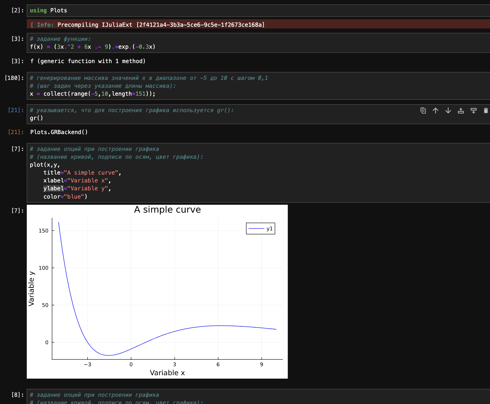{#fig:001 width=25%}

## Выполнение лабораторной работы

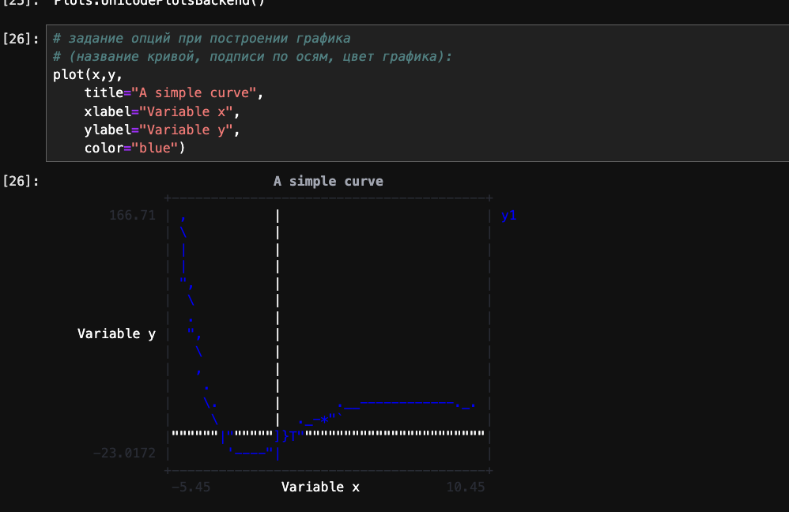{#fig:002 width=25%}

## Выполнение лабораторной работы

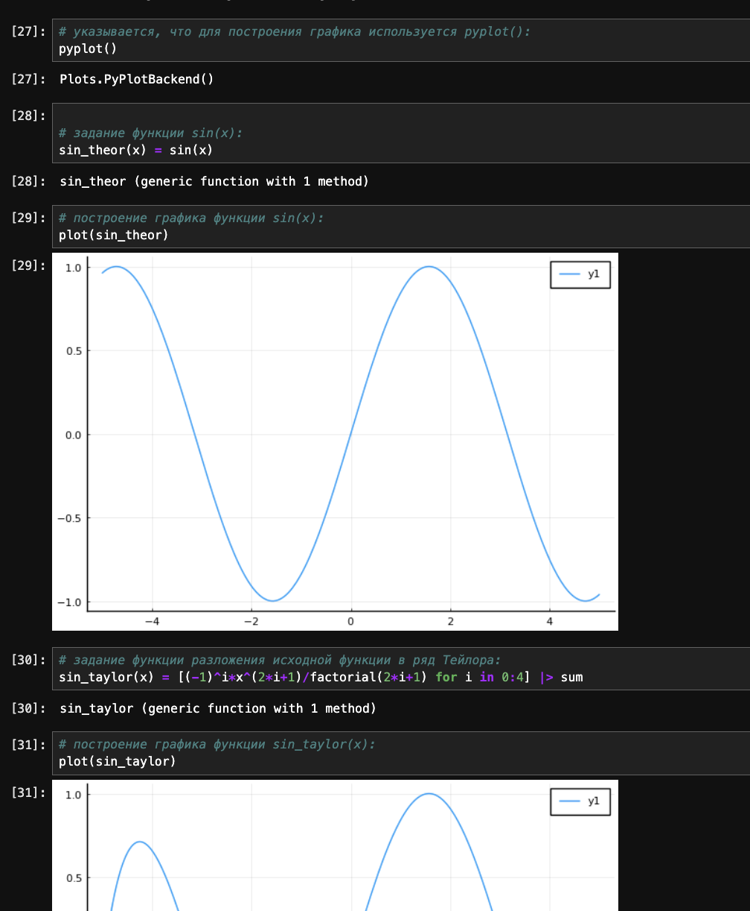{#fig:003 width=25%}

## Выполнение лабораторной работы

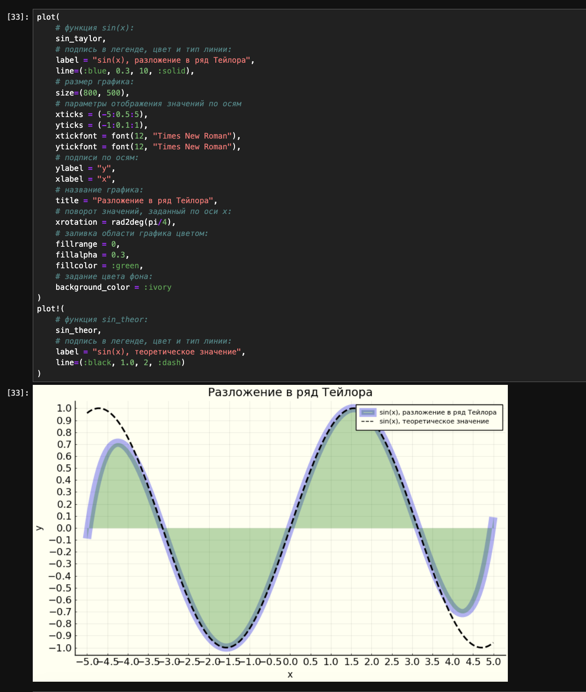{#fig:004 width=25%}

## Выполнение лабораторной работы

{#fig:005 width=25%}

## Выполнение лабораторной работы

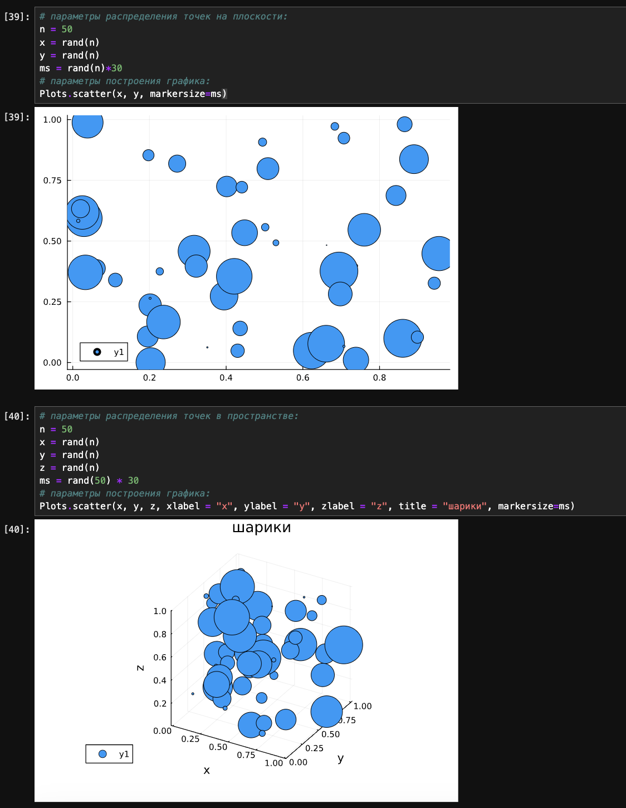{#fig:006 width=25%}

## Выполнение лабораторной работы

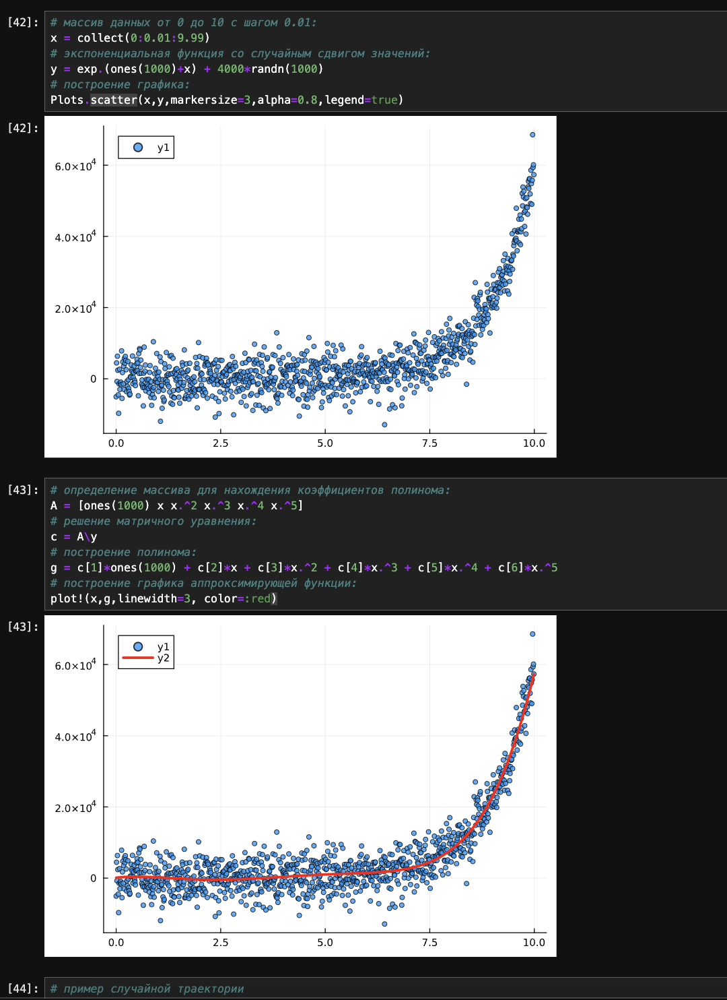{#fig:007 width=25%}

## Выполнение лабораторной работы

{#fig:008 width=25%}

## Выполнение лабораторной работы

{#fig:009 width=25%}

## Выполнение лабораторной работы

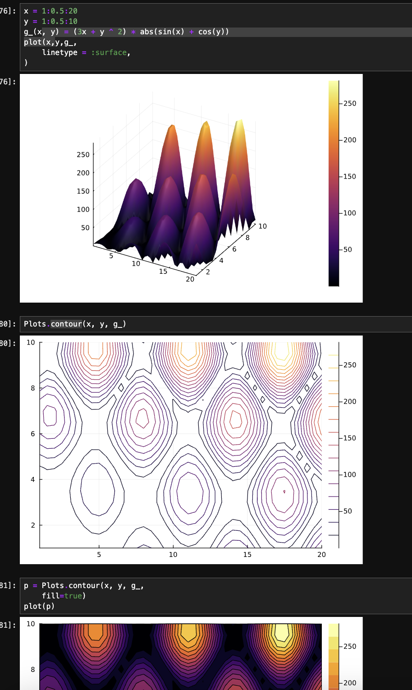{#fig:010 width=25%}

## Выполнение лабораторной работы

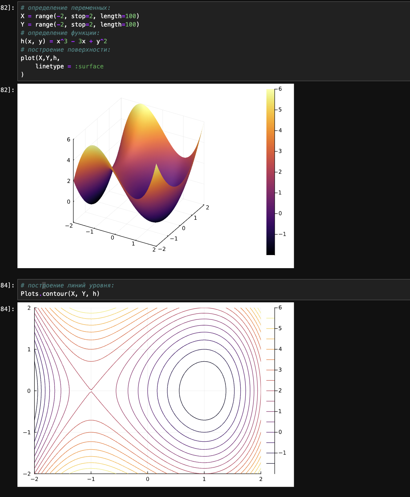{#fig:011 width=25%}

## Выполнение лабораторной работы

{#fig:012 width=25%}

## Выполнение лабораторной работы

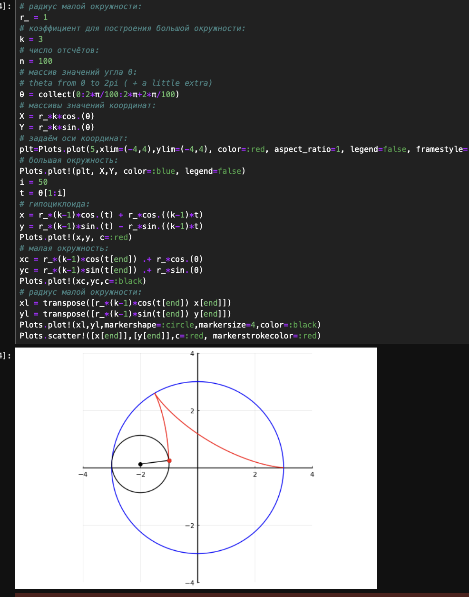{#fig:013 width=25%}

## Выполнение лабораторной работы

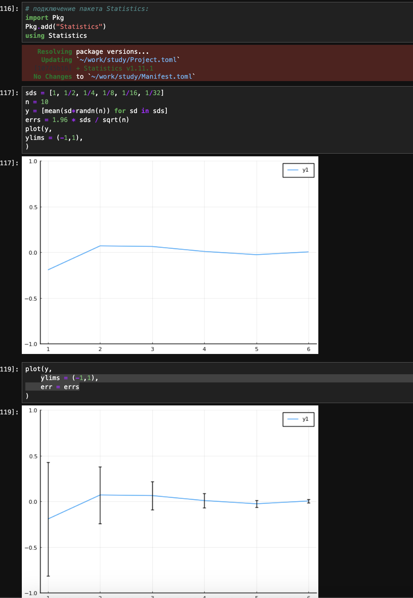{#fig:014 width=25%}

## Выполнение лабораторной работы

{#fig:015 width=25%}

## Выполнение лабораторной работы

{#fig:016 width=25%}

## Выполнение лабораторной работы

{#fig:017 width=25%}

## Выполнение лабораторной работы

{#fig:018 width=25%}

## Выполнение лабораторной работы

{#fig:019 width=25%}

## Задания для самостоятельного выполнения

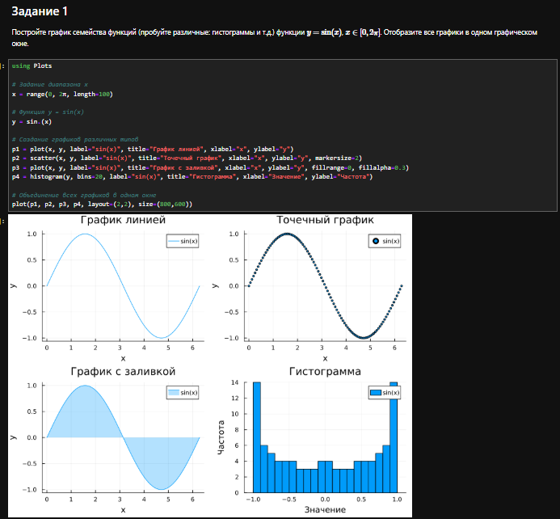{#fig:020 width=25%}

## Выполнение лабораторной работы

{#fig:021 width=25%}

## Выполнение лабораторной работы

{#fig:022 width=25%}

## Выполнение лабораторной работы

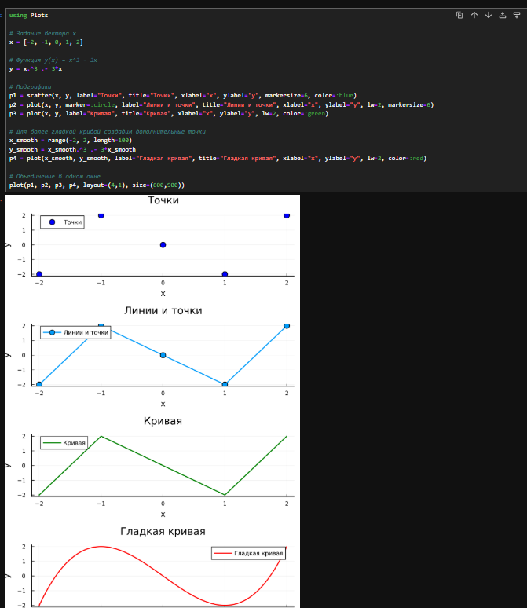{#fig:023 width=25%}

## Выполнение лабораторной работы

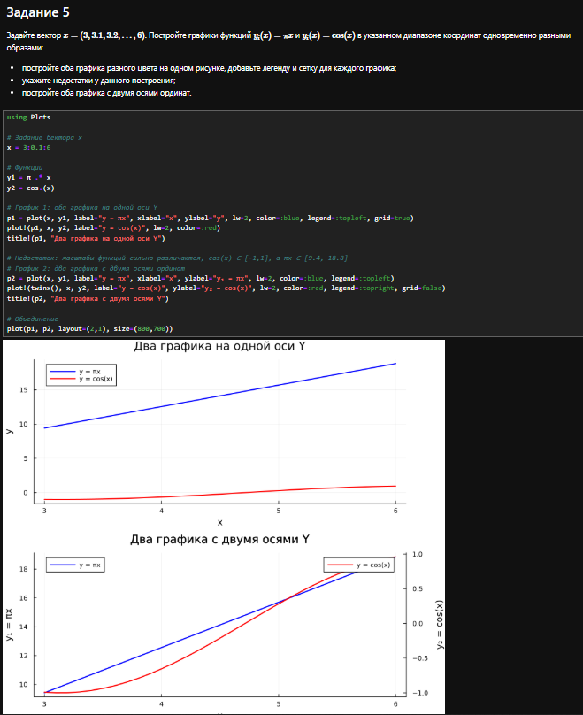{#fig:024 width=25%}

## Выполнение лабораторной работы

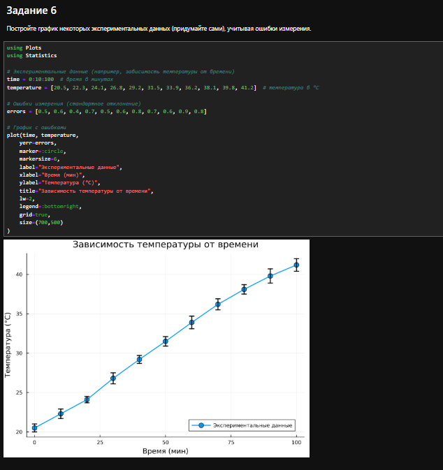{#fig:025 width=25%}

## Выполнение лабораторной работы

{#fig:026 width=25%}

## Выполнение лабораторной работы

{#fig:027 width=25%}

## Выполнение лабораторной работы

{#fig:028 width=25%}

## Выполнение лабораторной работы

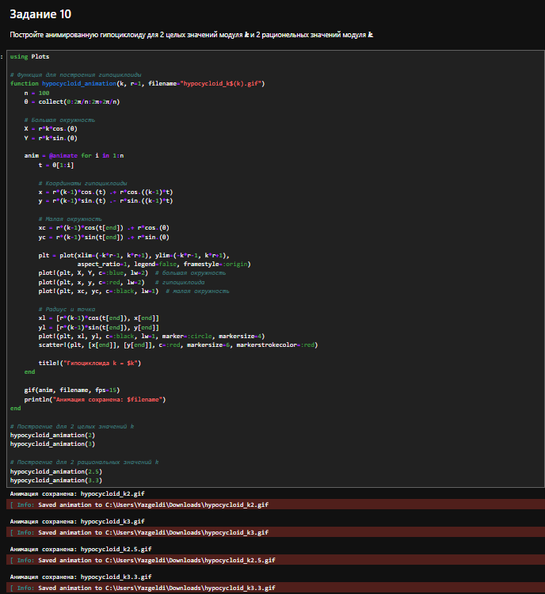{#fig:029 width=25%}

## Выполнение лабораторной работы

{#fig:030 width=25%}

## Выводы

В результате выполнения данной лабораторной работы я освоил синтаксис языка Julia для построения графиков.
