---
## Author
author:
  name: Оразгелдиев Язгелди
  degrees: DSc
  orcid: 0000-0002-0877-7063
  email: kulyabov-ds@rudn.ru
  affiliation:
    - name: Российский университет дружбы народов
      country: Российская Федерация

## Title
title: "Лабораторная работа 5"
subtitle: "Построение графиков"
license: "CC BY"
---

# Цель работы

Основная цель работы -- освоить синтаксис языка Julia для построения графиков.

# Задание

1. Используя JupyterLab, повторите примерыи. При этом дополните графики
обозначениями осей координат, легендой с названиями траекторий, названиями
графиков и т.п.

2. Выполните задания для самостоятельной работы.

# Теоретическое введение

Julia -- высокоуровневый свободный язык программирования с динамической типизацией, созданный для математических вычислений [@julialang]. Эффективен также и для написания программ общего назначения. Синтаксис языка схож с синтаксисом других математических языков, однако имеет некоторые существенные отличия.

Для выполнения заданий была использована официальная документация Julia [@juliadoc].

# Выполнение лабораторной работы

Выполним примеры из лабораторной работы для знакомства с пакетами по отрисовки графиков и их функциями (рис. [-@fig:001]-[-@fig:019]).

{#fig:001 width=70%}

{#fig:002 width=70%}

{#fig:003 width=70%}

{#fig:004 width=70%}

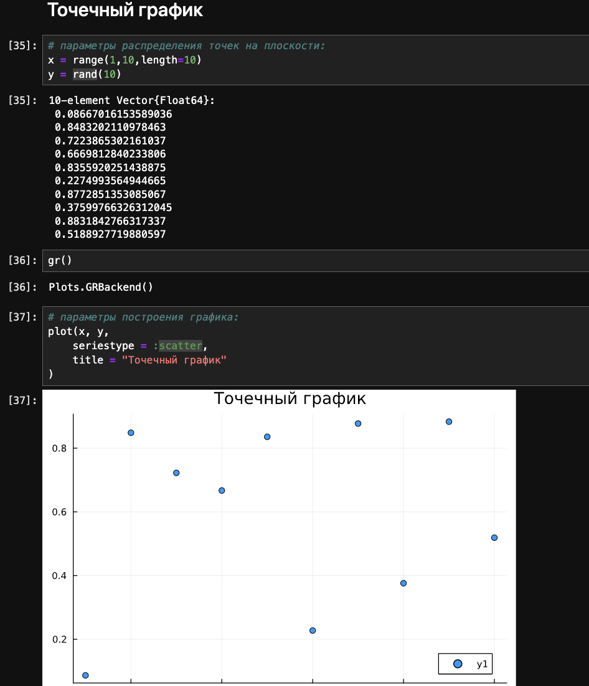{#fig:005 width=70%}

{#fig:006 width=70%}

{#fig:007 width=70%}

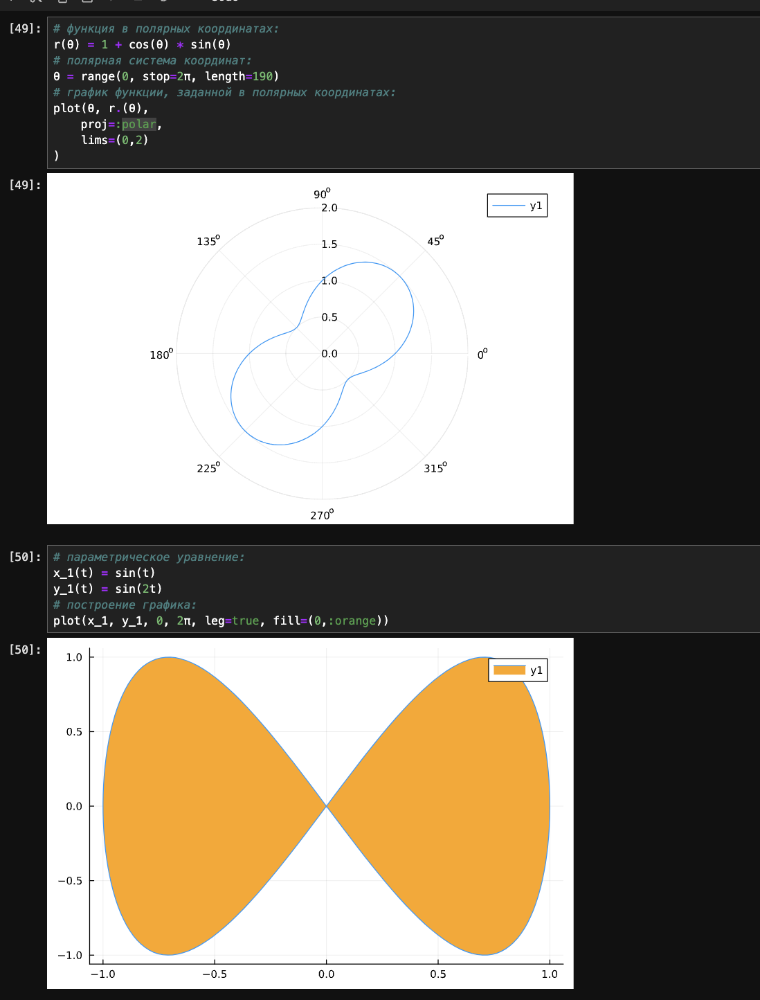{#fig:008 width=70%}

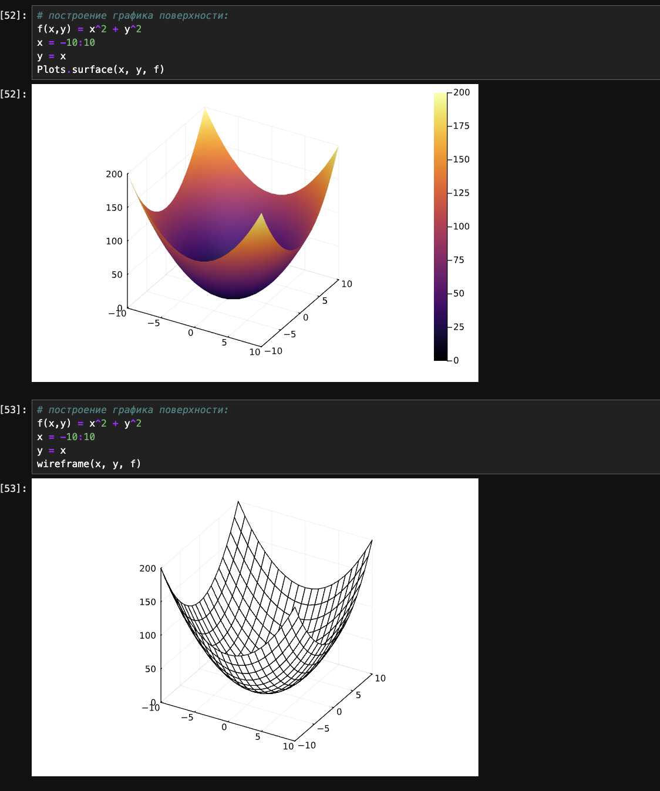{#fig:009 width=70%}

{#fig:010 width=70%}

{#fig:011 width=70%}

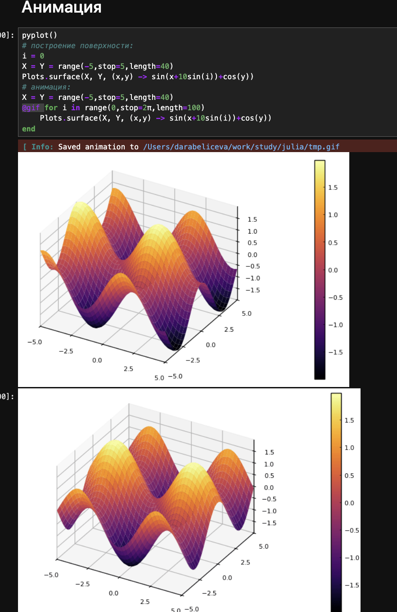{#fig:012 width=70%}

{#fig:013 width=70%}

{#fig:014 width=70%}

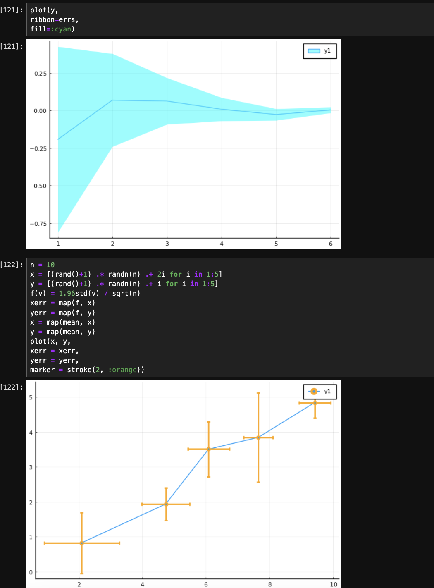{#fig:015 width=70%}

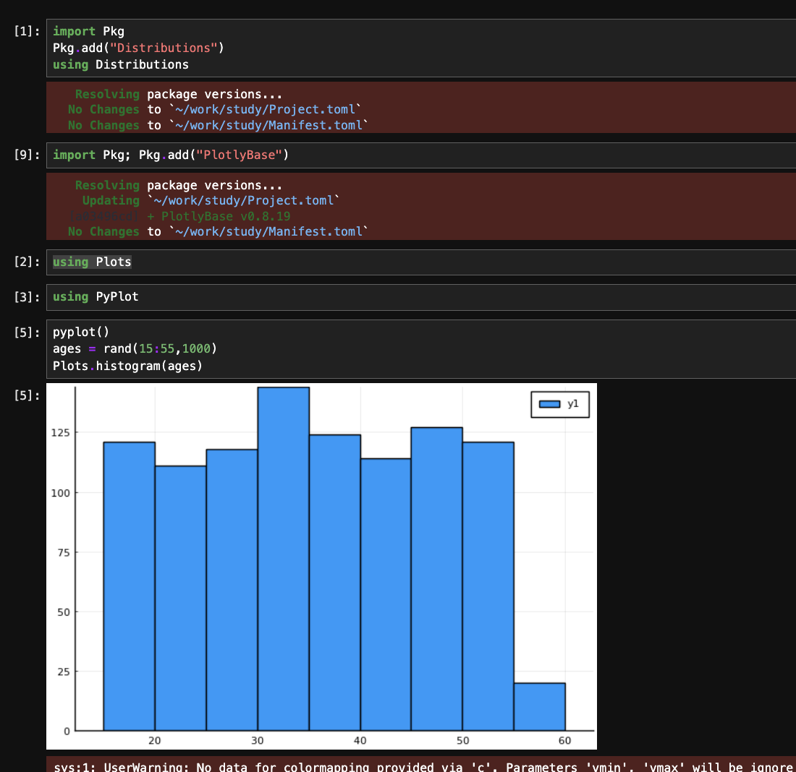{#fig:016 width=70%}

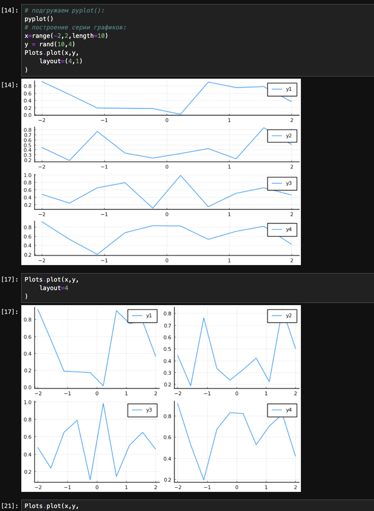{#fig:017 width=70%}

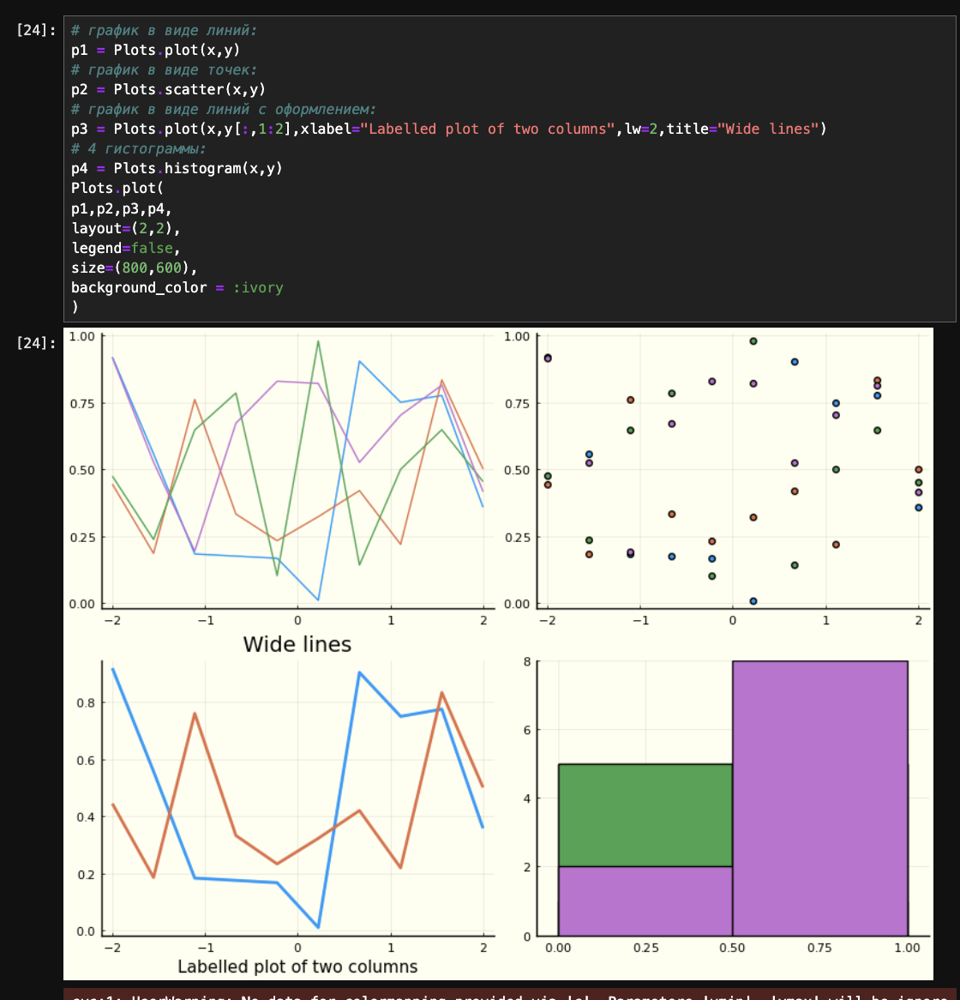{#fig:018 width=70%}

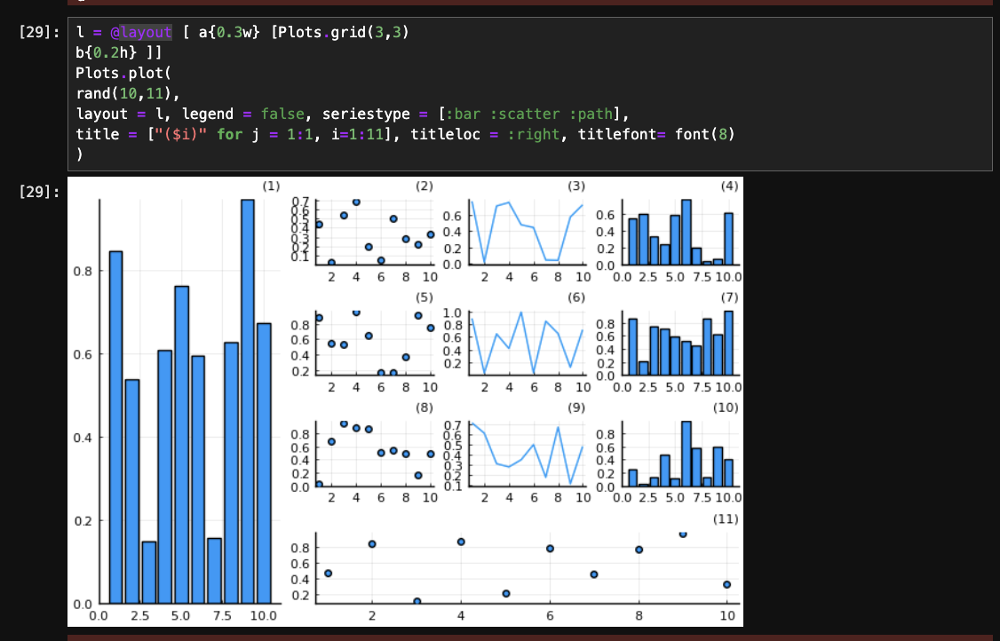{#fig:019 width=70%}

## Задания для самостоятельного выполнения

Выполним задания.

{#fig:020 width=70%}

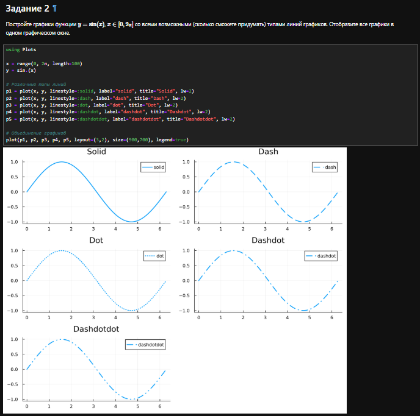{#fig:021 width=70%}

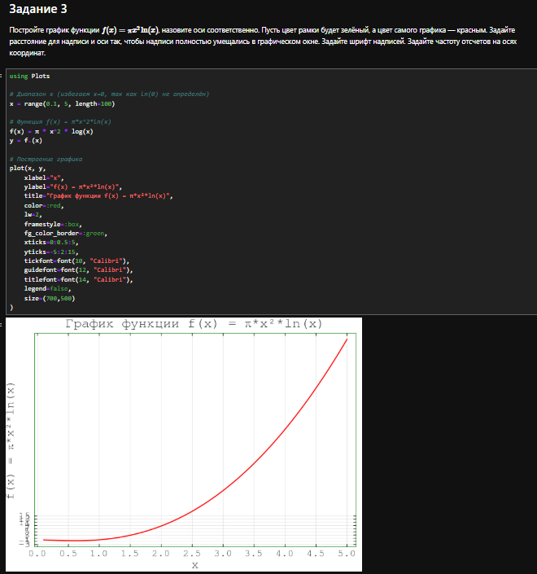{#fig:022 width=70%}

{#fig:023 width=70%}

{#fig:024 width=70%}

{#fig:025 width=70%}

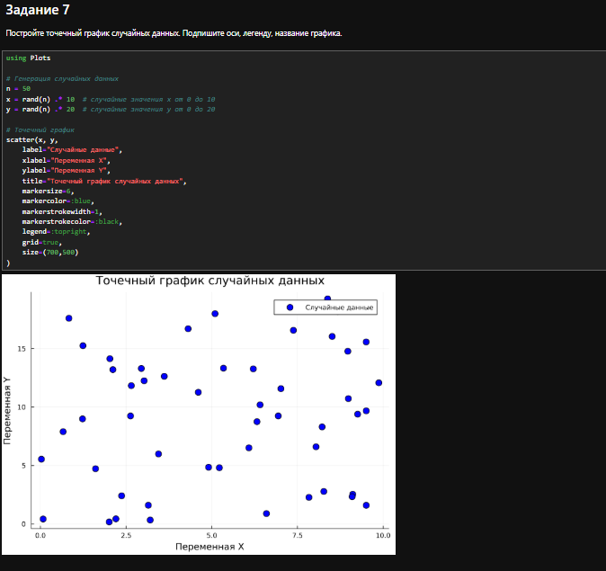{#fig:026 width=70%}

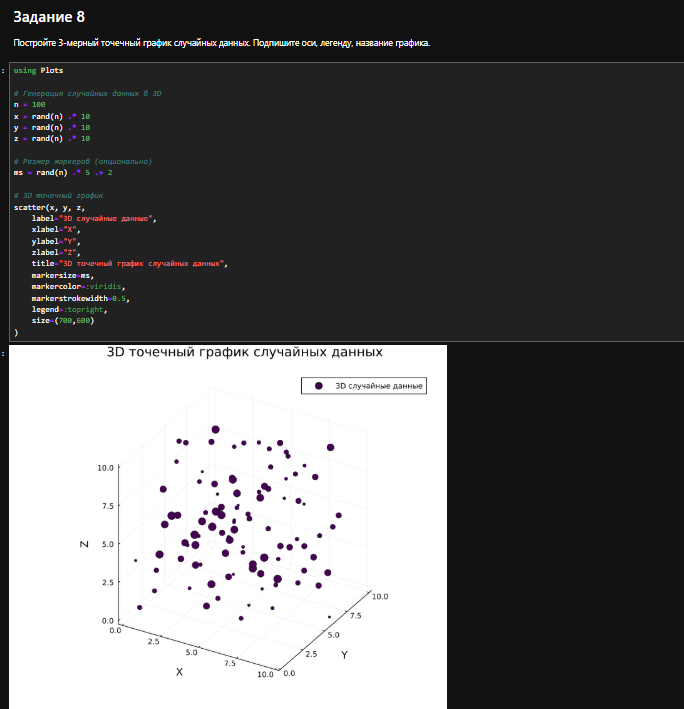{#fig:027 width=70%}

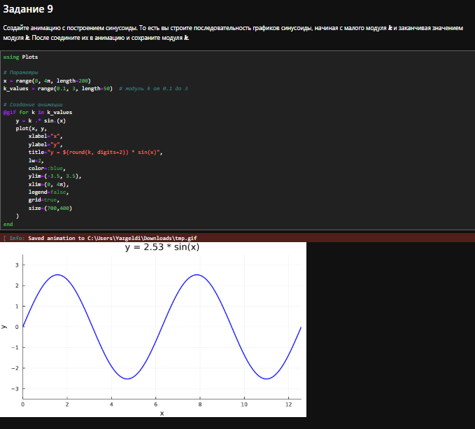{#fig:028 width=70%}

{#fig:029 width=70%}

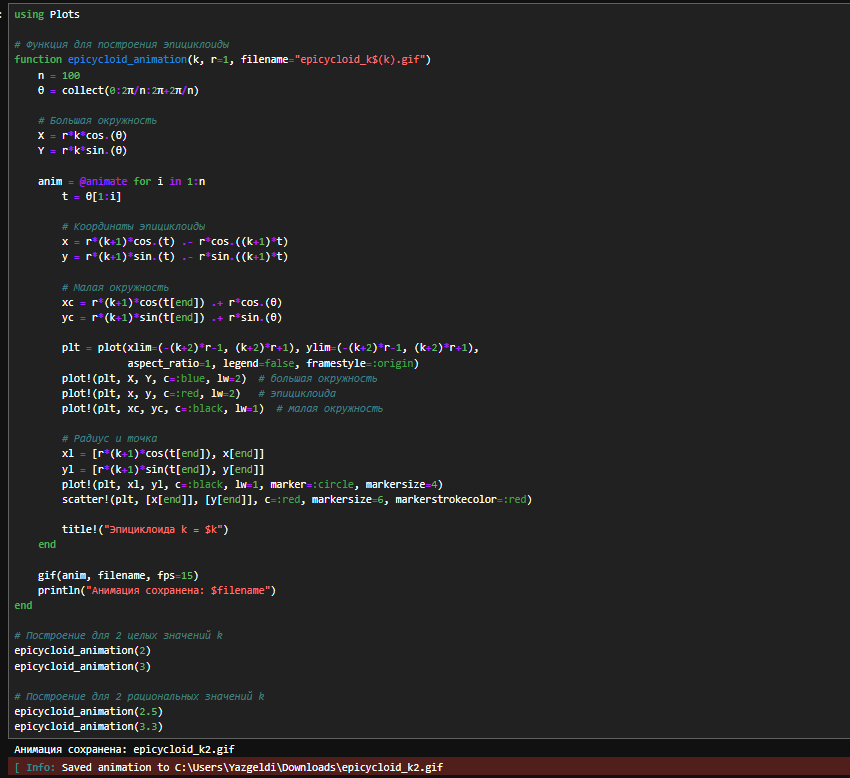{#fig:030 width=70%}

# Выводы

В результате выполнения данной лабораторной работы я освоил синтаксис языка Julia для построения графиков.
