---
## Author
author:
  name: Оразгелдиев Язгелди
  degrees: DSc
  orcid: 0000-0002-0877-7063
  email: 1032225075@pfur.ru
  affiliation:
    - name: Российский университет дружбы народов
      country: Российская Федерация
## Title
title: Лабораторная работа № 6
subtitle: ешение моделей в непрерывном и дискретном времени
license: CC BY
date: today
date-format: "YYYY-MM-DD" # Example: 2025-09-06
---

# Информация

## Докладчик

  * Оразгелдиев Язгелди
  * [1032225075@pfur.ru](mailto:1032225075@pfur.ru)
  * <https://github.com/YazgeldiOrazgeldiyev>

# Цель работы

Основной целью работы является освоение специализированных пакетов для решения задач в непрерывном и дискретном времени.

# Задание

1. Используя JupyterLab, повторите примерыи. При этом дополните графики
обозначениями осей координат, легендой с названиями траекторий, названиями
графиков и т.п.

2. Выполните задания для самостоятельной работы.

# Выполнение

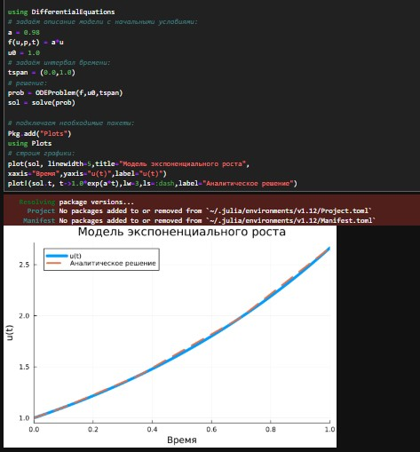{#fig:001 width=30%}

# Выполнение

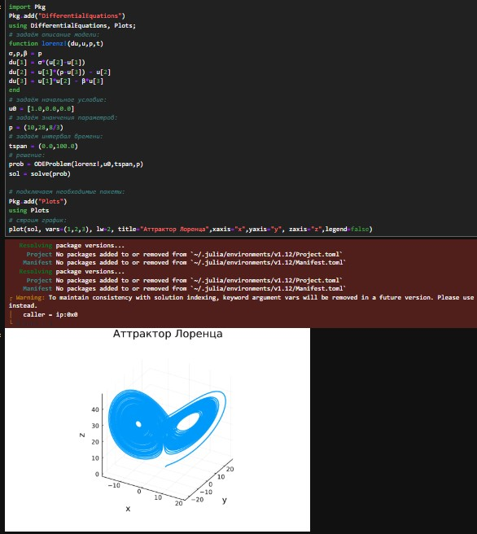{#fig:002 width=30%}

# Выполнение

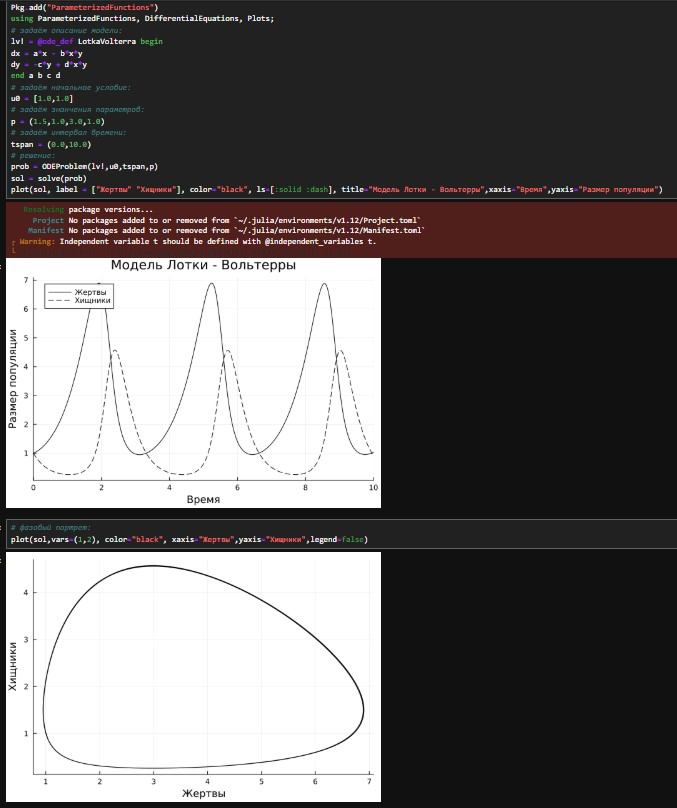{#fig:003 width=30%}

# Выполнение

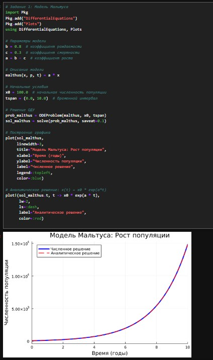{#fig:004 width=20%}

# Выполнение

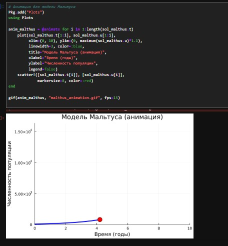{#fig:005 width=30%}

# Выполнение

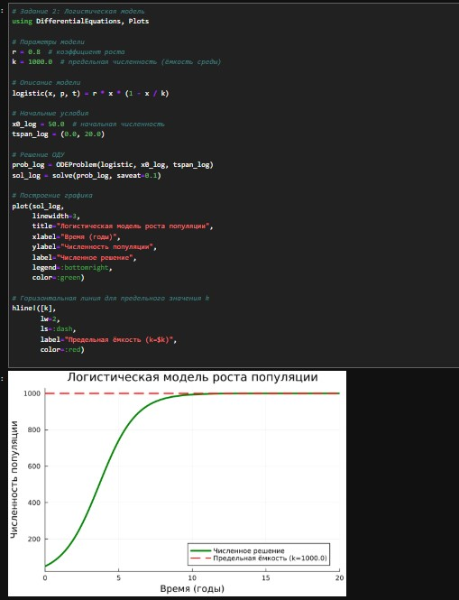{#fig:006 width=30%}

# Выполнение

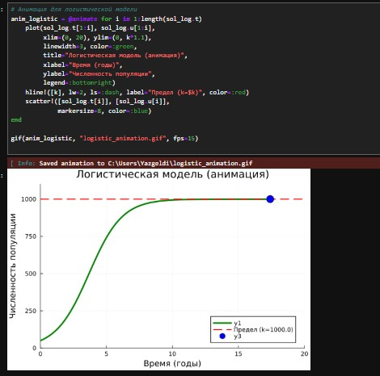{#fig:007 width=30%}

# Выполнение

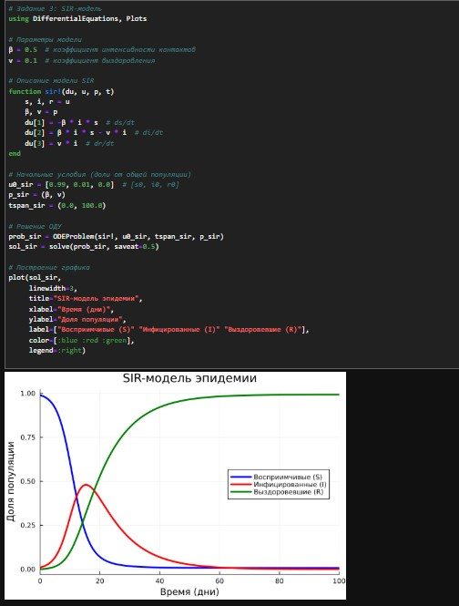{#fig:008 width=30%}

# Выполнение

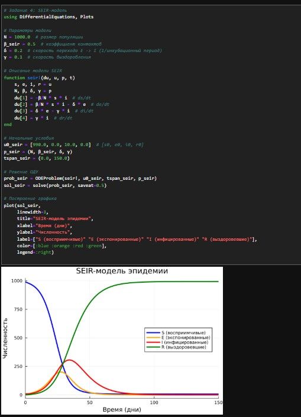{#fig:009 width=30%}

# Выполнение

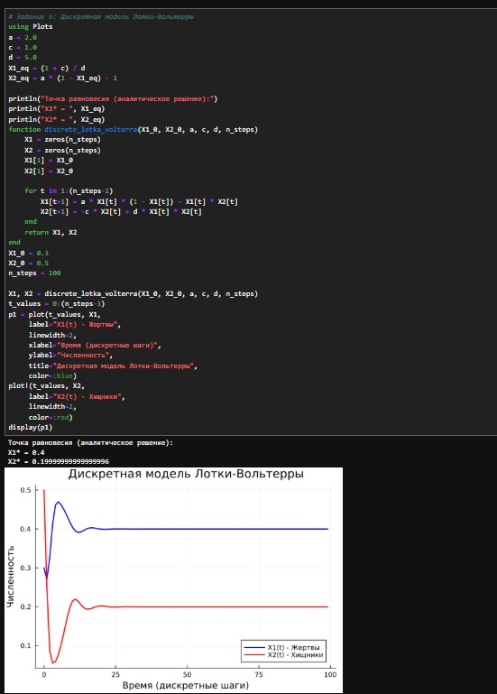{#fig:010 width=30%}

# Выполнение

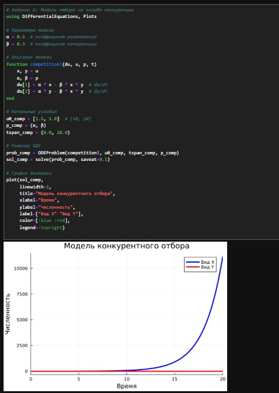{#fig:011 width=30%}

# Выполнение

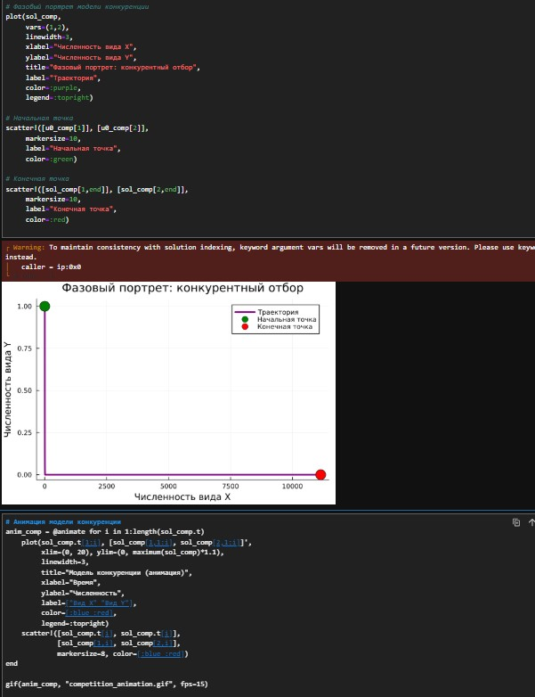{#fig:012 width=30%}

# Выполнение

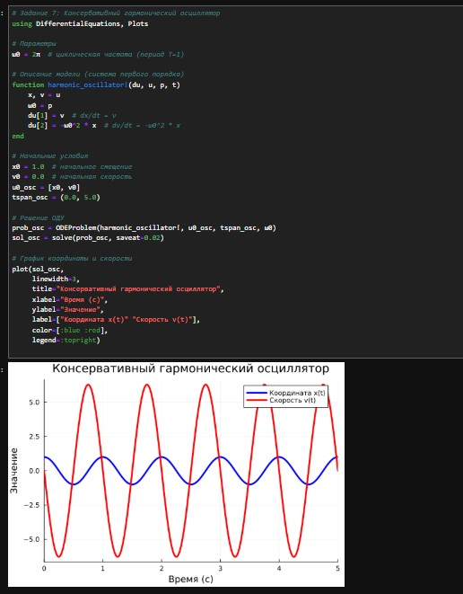{#fig:013 width=30%}

# Выполнение

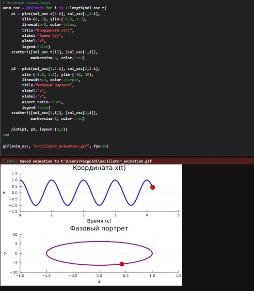{#fig:014 width=30%}

# Выполнение

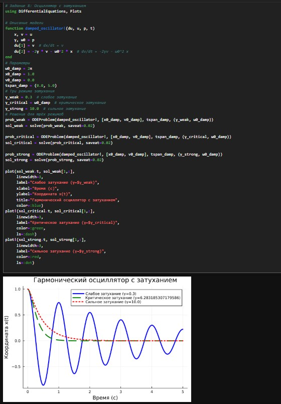{#fig:015 width=30%}

# Выполнение

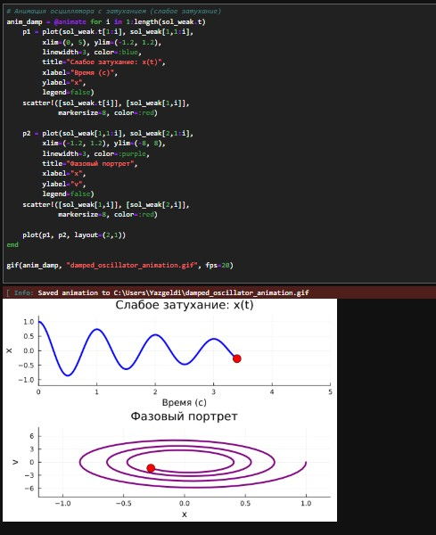{#fig:016 width=30%}

# Выводы

В результате выполнения данной лабораторной работы я освоил специализированные пакеты для решения задач в непрерывном и дискретном времени.
