---
## Author
author:
  name: Оразгелдиев Язгелди
  degrees: DSc
  orcid: 0000-0002-0877-7063
  email: 1032225075@pfur.ru
  affiliation:
    - name: Российский университет дружбы народов
      country: Российская Федерация
## Title
title: Лабораторная работа № 7
subtitle: Введение в работу сданными
license: CC BY
date: today
date-format: "YYYY-MM-DD" # Example: 2025-09-06
---

# Информация

## Докладчик

  * Оразгелдиев Язгелди
  * [1032225075@pfur.ru](mailto:1032225075@pfur.ru)
  * <https://github.com/YazgeldiOrazgeldiyev>

## Цель работы

Основной целью работы является освоение специализированных пакетов Julia для обработки данных.

## Задание

1. Используя JupyterLab, повторите примерыи. При этом дополните графики
обозначениями осей координат, легендой с названиями траекторий, названиями
графиков и т.п.

2. Выполните задания для самостоятельной работы.

## Выполнение лабораторной работы

{#fig:001 width=40%}

## Выполнение лабораторной работы

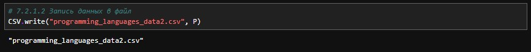{#fig:002 width=45%}

## Выполнение лабораторной работы

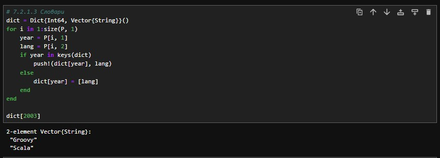{#fig:003 width=40%}

## Выполнение лабораторной работы

{#fig:004 width=35%}

## Выполнение лабораторной работы

{#fig:005 width=40%}

## Выполнение лабораторной работы

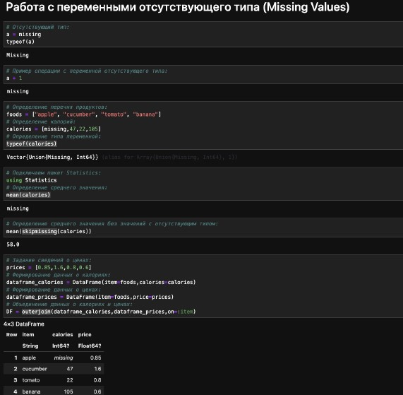{#fig:006 width=40%}

## Выполнение лабораторной работы

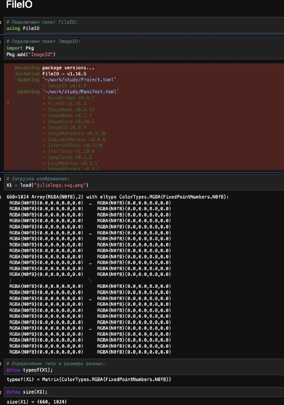{#fig:007 width=40%}

## Выполнение лабораторной работы

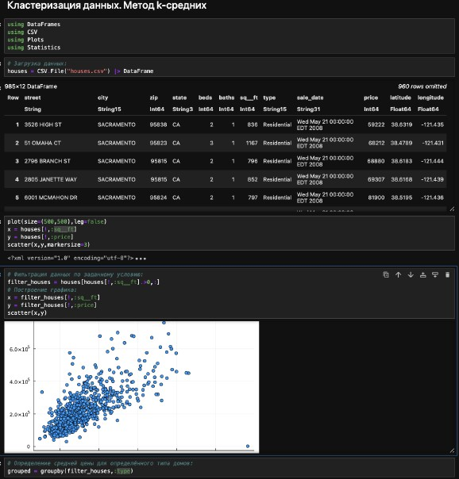{#fig:008 width=40%}

## Выполнение лабораторной работы

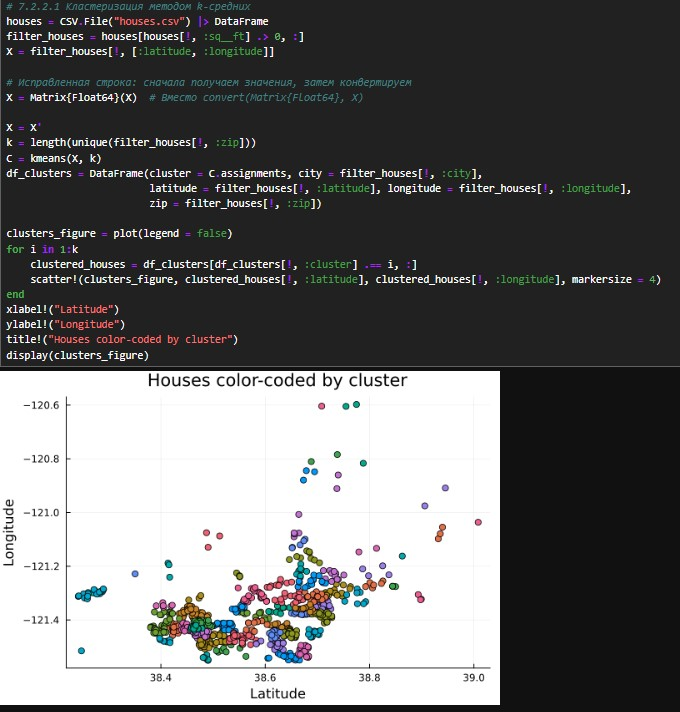{#fig:009 width=40%}

## Выполнение лабораторной работы

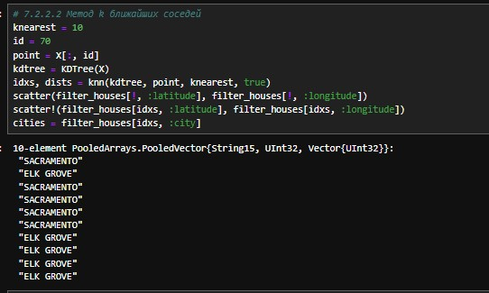{#fig:010 width=40%}

## Выполнение лабораторной работы

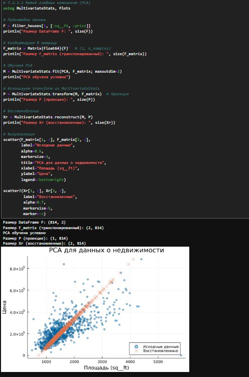{#fig:011 width=40%}

## Выполнение лабораторной работы

{#fig:012 width=35%}

## Выполнение лабораторной работы

{#fig:013 width=40%}

## Выполнение лабораторной работы

{#fig:014 width=40%}

## Выполнение лабораторной работы

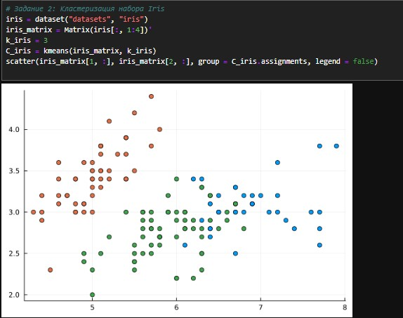{#fig:015 width=40%}

## Выполнение лабораторной работы

{#fig:016 width=45%}

## Выполнение лабораторной работы

{#fig:017 width=40%}

## Выполнение лабораторной работы

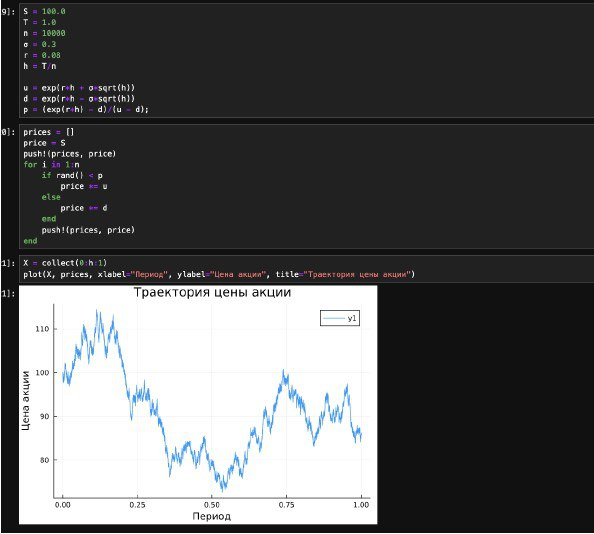{#fig:018 width=40%}

## Выполнение лабораторной работы

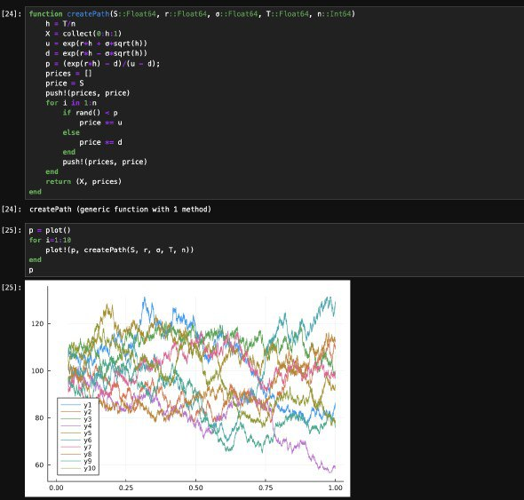{#fig:019 width=40%}

## Выполнение лабораторной работы

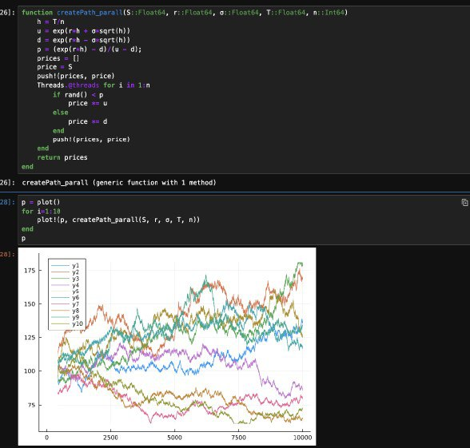{#fig:020 width=40%}

## Выводы

В результате выполнения данной лабораторной работы я освоил специализированные пакеты Julia для обработки данных.

## Список литературы

1. JuliaLang [Электронный ресурс]. 2024 JuliaLang.org contributors. URL:https://julialang.org/(дата обращения: 11.10.2024).
2. Julia  1.11  Documentation  [Электронный  ресурс].  2024  JuliaLang.orgcontributors. URL:https://docs.julialang.org/en/v1/(дата обращения:11.10.2024).
