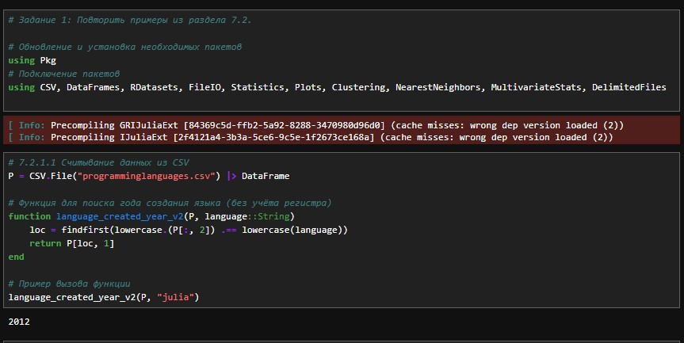
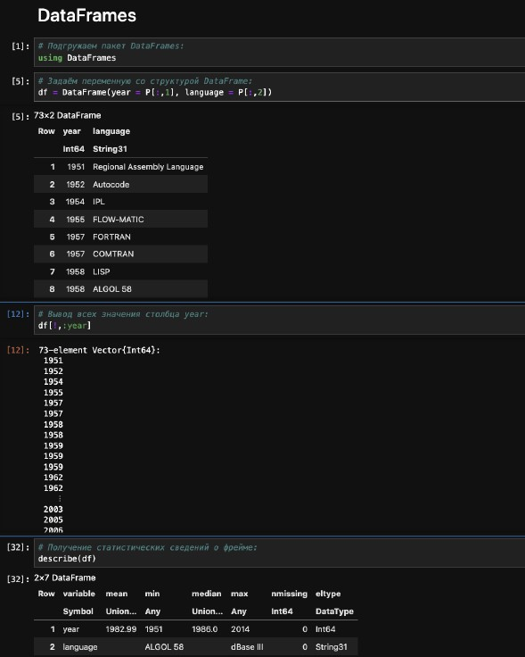
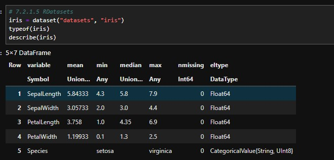
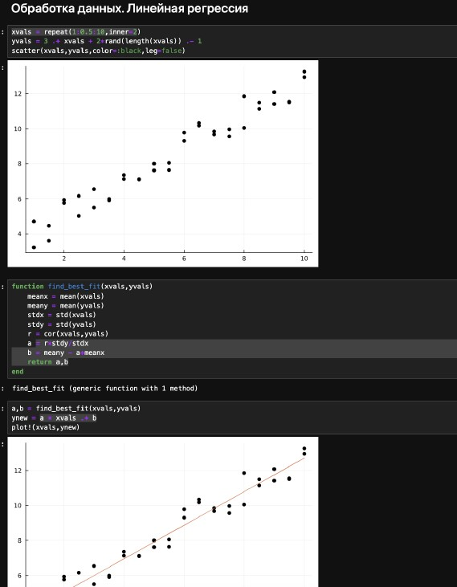
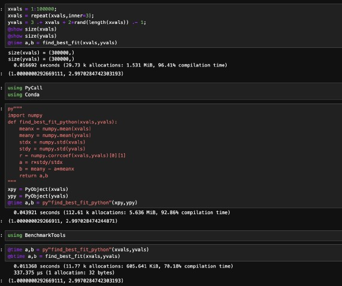
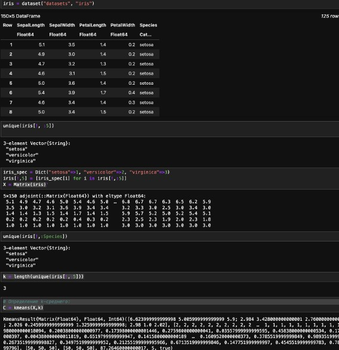
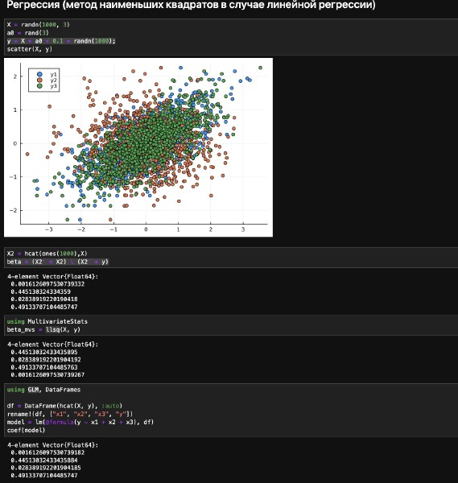
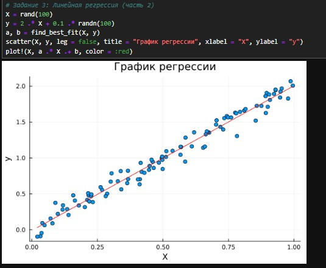

---
## Author
author:
  name: Оразгелдиев Язгелди
  degrees: DSc
  orcid: 0000-0002-0877-7063
  email: 1032225075@pfur.ru
  affiliation:
    - name: Российский университет дружбы народов
      country: Российская Федерация

## Title
title: "Лабораторная работа № 7"
subtitle: "Введение в работу сданными"
license: "CC BY"
---

# Цель работы

Основной целью работы является освоение специализированных пакетов Julia для обработки данных.

# Задание

1. Используя JupyterLab, повторите примерыи. При этом дополните графики
обозначениями осей координат, легендой с названиями траекторий, названиями
графиков и т.п.

2. Выполните задания для самостоятельной работы.

# Теоретическое введение

Julia -- высокоуровневый свободный язык программирования с динамической типизацией, созданный для математических вычислений [@julialang]. Эффективен также и для написания программ общего назначения. Синтаксис языка схож с синтаксисом других математических языков, однако имеет некоторые существенные отличия.

Для выполнения заданий была использована официальная документация Julia [@juliadoc].

# Выполнение лабораторной работы

Выполним примеры из лабораторной работы (рис. [-@fig:001]-[-@fig:013]).

{#fig:001 width=70%}

{#fig:002 width=70%}

{#fig:003 width=70%}

{#fig:004 width=70%}

{#fig:005 width=70%}

{#fig:006 width=70%}

{#fig:007 width=70%}

{#fig:008 width=70%}

{#fig:009 width=70%}

{#fig:010 width=70%}

{#fig:011 width=70%}

{#fig:012 width=70%}

{#fig:013 width=70%}

Теперь выполним задания для самостоятельный работы.

Загрузим

```Julia
using RDatasets
iris = dataset("datasets", "iris")
```

Используем Clustering.jl для кластеризации на основе k-средних. Сделаем точечную диаграмму полученных кластеров. Для этого проиндексируем фрейм данных, преобразуем его
в массив и транспонируем (рис. [-@fig:014]).

{#fig:014 width=70%}

{#fig:015 width=70%}

Пусть регрессионная зависимость являетсял инейной. Матрица наблюдений
факторов $X$ имеет размерность $N \times 3$ `randn (N, 3)`, массив результато в $N \times 1$, регрессионная зависимость является линейной.Найдем МНК-оценку для линейной модели.

- Сравним свои результаты с результатами использования `llsq` из
`MultivariateStats.jl`.
- Сравним свои результаты с результатамии спользования регулярной регрессии наименьших квадратов из `GLM.jl`.

Cоздадим матрицу данных $X2$, которая добавляет столбец единиц в начало матрицы данных, и решим систему линейных уравнений.

{#fig:016 width=70%}

Найдем линию регрессии, используя данные $(X, y)$. Построем график $(X, y)$,
используя точечный график. Добавим линию регрессии, используя abline!. Добавим заголовок «График регрессии» и подпишим оси $x$ и $y$.

{#fig:017 width=70%}

Построим траекторию возможных цен на акции:

- $S$ -- начальная цена акции;
- $T$ -- длина биномиального дерева в годах;
- $n$ -- количество периодов;
- $h = Tn$ -- длина одного периода;
- $\sigma$ -- волатильность акции;
- $r$ -- годовая процентная ставка;
- $u = \mathrm{exp}(rh + \sigma \sqrt{h})$;
- $d = \mathrm{exp}(rh - \sigma \sqrt{h})$;
- $p^* = \dfrac{\mathrm{exp}(rh) -d}{u - d}$;


Пусть $S = 100, \, T = 1, \, n = 10000, \, \sigma = 0.3$ и $r = 0.08$. Попробуем  построить траекторию курса акций. 

{#fig:018 width=70%}

Создадим функцию `createPath (S ::Float64, r ::Float64, sigma ::Float64, T ::Float64, n ::Int64)`, которая создает траекторию цены ак-
ции с учетом начальных параметров. Используем `createPath`, чтобы создать 10
разных траекторий и построим их все на одном графике.

{#fig:019 width=70%}

Распараллелим генерацию траектории. Можем использовать `Threads.@threads`,
`pmap` и `@parallel`.

{#fig:020 width=70%}

# Выводы

В результате выполнения данной лабораторной работы я освоил специализированные пакеты Julia для обработки данных.

